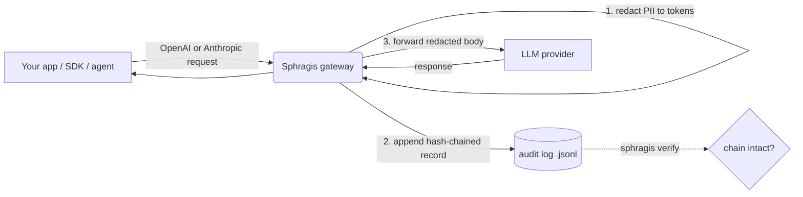

<div align="center">

# Sphragis

**An EU AI Act compliance gateway you actually control.**

A drop-in, OpenAI- and Anthropic-compatible proxy that redacts personal data
before it leaves your network and writes a tamper-evident, hash-chained audit
log of every model call. One static binary, runs inside your trust boundary.
We never see your prompts.

[](https://sphragis.eu)
[](LICENSE)
[](go.mod)
[](#project-status)

[**sphragis.eu**](https://sphragis.eu) &nbsp;&bull;&nbsp; [Quick start](#quick-start) &nbsp;&bull;&nbsp; [Contributing](CONTRIBUTING.md) &nbsp;&bull;&nbsp; [Roadmap](ROADMAP.md)

</div>

> The name is the Greek σφραγίς (*sphragís*), the seal pressed into wax to prove
> a document was untampered and authentic. That is exactly what the audit log does.

> **Status: early.** The core proxy, PII redaction, hash-chained log,
> verification, and OpenTimestamps anchoring work and are tested. Bundled ML
> entity recognition and output redaction are on the [roadmap](#roadmap).

## Why

The EU AI Act and GDPR both push you to (a) keep personal data out of
third-party model providers where you can, and (b) prove what you did with it.

The common "fix" is to route prompts through a third-party SaaS scrubber, which
just hands your data to *another* processor. Sphragis inverts that:

- **Redaction happens locally.** Personal data is replaced with stable tokens
  (`[EMAIL_1]`, `[IBAN_1]`, ...) before a single byte leaves your machine.
- **The audit log is local and tamper-evident.** Every call is hash-chained, so
  altering, reordering or dropping a record breaks verification.
- **Only an opaque hash ever needs to leave**, and only if you opt into public
  anchoring. Your prompts never reach us. There is no "us" in the data path.

## How it works



1. The gateway parses the request body for the route's wire format.
2. PII is detected and replaced with stable `[KIND_n]` tokens.
3. A record is appended to an append-only log: `sha256(payload)`, the previous
   record's hash, sequence number and timestamp, all chained.
4. The redacted request is forwarded upstream. If the audit write fails, the
   gateway **fails closed** and refuses to forward the call.

`sphragis verify` later replays the log, checks every chain link and per-record
hash, and prints the Merkle root of all payload hashes.

## Quick start

```bash
make build

export SPHRAGIS_UPSTREAM_BASE_URL=https://api.openai.com
export SPHRAGIS_UPSTREAM_API_KEY=sk-...        # your real provider key
./sphragis serve                                # listens on :8787
```

Point any OpenAI SDK at the gateway by changing the base URL to
`http://localhost:8787/v1`. Personal data in message content is tokenized before
the request is forwarded upstream, and each call is appended to the audit log.

Verify the log has not been tampered with:

```bash
./sphragis verify sphragis-audit.jsonl
# OK: 42 records, chain intact
# merkle_root: 58075bc5...
```

If any record was altered, reordered or removed, verification fails and names
the offending sequence number.

## Install

```bash
# macOS / Linux, one line (downloads a prebuilt binary):
curl -fsSL https://sphragis.eu/install.sh | bash

# Homebrew (macOS / Linux):
brew install sphragis-oss/sphragis/sphragis

# from source:
make install        # PREFIX overridable, needs Go
```

Releases are built and the Homebrew formula published by GoReleaser
(`.goreleaser.yaml`) on tag push via `.github/workflows/release.yml`. systemd and
launchd unit templates live in `init/`.

## Running it (daemon)

```bash
sphragis start          # run in the background (pid, logs, state under ~/.sphragis)
sphragis status         # running? listen addr, audit log, auto-anchor state
sphragis restart
sphragis stop

sphragis anchor on 24h  # enable automatic anchoring every 24h
sphragis anchor off     # disable
sphragis anchor status  # show auto-anchor state
sphragis anchor now     # anchor the current log once
```

State, logs and the default audit log live in `~/.sphragis` (override with
`SPHRAGIS_HOME`). Use `sphragis serve` to run in the foreground instead.

## Supported request formats

Redaction dispatches on the request path, so one gateway covers the major agent
and SDK clients:

| Path | Format | Used by |
|---|---|---|
| `/v1/chat/completions` | OpenAI chat completions | OpenAI SDKs, Cursor, LangChain |
| `/v1/responses` | OpenAI Responses API | Codex CLI |
| `/v1/messages` | Anthropic Messages API | Claude Code |
| `/v1/messages/count_tokens` | Anthropic token counting | Claude Code, SDKs |
| `/v1/messages/batches` | Anthropic Message Batches | batch jobs |
| `/v1/complete` | Anthropic legacy Text Completions | legacy clients |

Point each client at the gateway:

- Claude Code: `ANTHROPIC_BASE_URL=http://localhost:8787`
- Codex: `OPENAI_BASE_URL=http://localhost:8787/v1`
- OpenAI SDKs: base URL `http://localhost:8787/v1`

Both string and structured bodies are handled, including Anthropic `document`
blocks, `tool_use` inputs and `tool_result` content. Signed `thinking` blocks are
left intact so signatures stay valid. Streamed (`stream: true`) responses are
flushed through chunk by chunk. Other paths are proxied through unchanged, with
no redaction.

## What gets redacted today

| Kind | Token | Matcher |
|---|---|---|
| Email | `[EMAIL_n]` | RFC-ish address pattern |
| Phone | `[PHONE_n]` | `+CC NN NNNNN` international form |
| IBAN | `[IBAN_n]` | country code + check digits + groups |
| Card | `[CARD_n]` | 13-19 digit PAN, Luhn-validated |
| SSN | `[SSN_n]` | US `NNN-NN-NNNN` |
| IP | `[IP_n]` | IPv4 address |
| Secret | `[SECRET_n]` | value after `password`/`secret`/`api_key`/`token`, and `Bearer` tokens |
| API key | `[APIKEY_n]` | OpenAI/Anthropic, AWS, GitHub, Google, Slack, Stripe, SendGrid |
| Private key | `[PRIVATEKEY_n]` | PEM `BEGIN ... PRIVATE KEY` blocks |
| JWT | `[JWT_n]` | three base64url segments |
| Name (custom) | `[NAME_n]` | org-supplied term list (see Configuration) |
| Name / Address / Health | `[NAME_n]` `[ADDRESS_n]` `[HEALTH_n]` | optional external NER service (see below) |

Tokens are stable within a text field: the same value maps to the same number, so
the model can still reason about "the same person" without seeing them.

Arbitrary names, addresses and health terms cannot be matched by regex. Point
`SPHRAGIS_NER_URL` at an NER service (e.g. a Microsoft Presidio sidecar) that
accepts `{"text": "..."}` and returns `{"entities": [{"type": "PERSON", "text":
"..."}]}`. The gateway tokenizes the returned spans. NER is best-effort and fails
open, so an NER outage never blocks regex redaction. Without it, use the
custom-terms file for known names and codenames.

## Anchoring

`sphragis anchor <audit-log-path>` verifies the log, then submits its Merkle root
to public OpenTimestamps calendar servers and writes a `.ots` proof next to the
log. The proof is initially pending; run `ots upgrade <file>.ots` later to attach
the Bitcoin attestation, and `ots verify` to check it. Only the opaque root hash
leaves your network, never the prompts. Override the calendars with
`SPHRAGIS_OTS_CALENDARS` (comma-separated).

## Configuration

| Env var | Default | Purpose |
|---|---|---|
| `SPHRAGIS_LISTEN_ADDR` | `:8787` | Address the gateway listens on |
| `SPHRAGIS_UPSTREAM_BASE_URL` | `https://api.openai.com` | Upstream LLM provider base URL |
| `SPHRAGIS_UPSTREAM_API_KEY` | (none) | Provider key; if unset, the client's `Authorization` header is forwarded |
| `SPHRAGIS_AUDIT_LOG_PATH` | `~/.sphragis/audit.jsonl` | Append-only audit log path |
| `SPHRAGIS_HOME` | `~/.sphragis` | State directory (pid, logs, default audit log) |
| `SPHRAGIS_CUSTOM_TERMS_FILE` | (none) | File of extra terms to redact, one per line (names, codenames) |
| `SPHRAGIS_NER_URL` | (none) | External NER service for names/addresses/health terms |
| `SPHRAGIS_OTS_CALENDARS` | public OTS calendars | Comma-separated OpenTimestamps calendar URLs |

## Roadmap

- Redaction of model output (responses currently pass through unscanned).
- Automatic periodic anchoring (today `anchor` is run on demand).
- Configurable per-route redaction policy.
- Container image and Kubernetes deployment manifests.

## Project status

Sphragis is open source under Apache 2.0 and built in the open. The long-term
goal is to grow it into a community-governed, vendor-neutral project and donate
it to the [CNCF](https://www.cncf.io/). If that interests you, contributions,
issues and design feedback are all welcome.

## Commercial offering

Sphragis the project is, and will remain, fully open source. A separate
commercial product (managed deployment, multi-user admin, SSO/RBAC, team
policies, the EU AI Act Article 26/53 report generator and managed anchoring) is
built *on top of* this open core, in its own repository. This mirrors the
Crossplane / Upbound model: the open project stands on its own, the commercial
product is an optional layer above it. Nothing in this repository requires a
license key.

## Development

```bash
make test     # go test ./...
make vet
make build
```

## Contributing

Issues and pull requests are welcome. By contributing you agree that your
contribution is licensed under Apache 2.0. A `CONTRIBUTING.md` and code of
conduct will land alongside the move toward open governance.

## License

[Apache License 2.0](LICENSE). See [NOTICE](NOTICE) for attribution.
