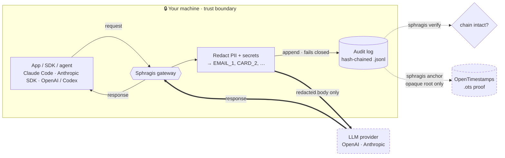

<div align="center">


# Sphragis

**The EU AI Act compliance gateway you actually control.**

A single Go binary that sits between your apps and any OpenAI- or
Anthropic-compatible LLM, with **first-class support for Claude** (Claude Code
and the Anthropic SDKs). It strips personal data out of every request *before*
it leaves your network and writes a tamper-evident, hash-chained record of each
call. Self-hosted, no SaaS in the data path. We never see your prompts.

[](https://sphragis.eu)
[](LICENSE)
[](go.mod)
[](https://github.com/sphragis-oss/sphragis/actions/workflows/ci.yml)
[](#project-status)

[**sphragis.eu**](https://sphragis.eu) &nbsp;&bull;&nbsp; [Quick start](#quick-start) &nbsp;&bull;&nbsp; [Install](#install) &nbsp;&bull;&nbsp; [Contributing](CONTRIBUTING.md) &nbsp;&bull;&nbsp; [Changelog](CHANGELOG.md)

</div>

> The name is the Greek σφραγίς (*sphragís*), the seal pressed into wax to prove a
> document is authentic and untampered. That is exactly what the audit log does.

> **Status: early.** The proxy, PII/secret redaction of both requests and model
> output, the hash-chained audit log, verification, and OpenTimestamps anchoring
> all work and are tested. A bundled ML entity-recognition service is planned.

## Why

The EU AI Act and GDPR pull you two ways at once: keep personal data out of
third-party model providers, **and** be able to prove what you sent and when.

The usual "fix" is a third-party SaaS scrubber, which just hands your data to
*another* processor. Sphragis inverts that. Everything happens inside your own
trust boundary:

- **Redaction is local.** Emails, cards, IBANs, secrets, keys and more are
  replaced with stable tokens (`[EMAIL_1]`, `[IBAN_1]`, ...) before a single byte
  leaves the machine.
- **The audit log is local and tamper-evident.** Every call is hash-chained;
  altering, reordering or dropping any record breaks verification.
- **Only an opaque hash ever leaves**, and only if you opt into public anchoring.
  Your prompts never reach us. There is no "us" in the data path.

## How it works



1. The gateway parses the request body for its wire format (OpenAI or Anthropic).
2. PII and secrets are detected and replaced with stable `[KIND_n]` tokens.
3. A record is appended to an append-only log: `sha256(redacted payload)`, the
   previous record's hash, a sequence number and timestamp, all chained.
4. The redacted request is forwarded upstream. **If the audit write fails, the
   gateway fails closed** and refuses to forward the call.

`sphragis verify` later replays the log, checks every chain link and per-record
hash, and prints the Merkle root. `sphragis anchor` timestamps that root publicly
so you can later prove the log existed at a point in time.

## Quick start

```bash
make build

export SPHRAGIS_UPSTREAM_BASE_URL=https://api.openai.com
export SPHRAGIS_UPSTREAM_API_KEY=sk-...   # your real provider key
./sphragis serve                          # foreground, listens on :8787
```

Point any OpenAI SDK at the gateway by setting the base URL to
`http://localhost:8787/v1`. PII in message content is tokenized before the
request is forwarded, and every call is appended to the audit log.

Verify the log has not been tampered with:

```bash
./sphragis verify ~/.sphragis/audit.jsonl
# OK: 42 records, chain intact
# merkle_root: 58075bc5...
```

If any record was altered, reordered or removed, verification fails and names the
offending sequence number.

## Install

**Homebrew (macOS):**

```bash
brew install --cask sphragis-oss/sphragis/sphragis
```

**Script (macOS / Linux), prebuilt binary:**

```bash
curl -fsSL https://raw.githubusercontent.com/sphragis-oss/sphragis/main/install.sh | bash
```

**Docker (multi-arch image):**

```bash
docker run -p 8787:8787 -v sphragis:/data ghcr.io/sphragis-oss/sphragis
```

The image runs as a non-root user and serves on `:8787`. The `/data` volume
holds the audit log and vault (it is the container's `SPHRAGIS_HOME`). Pass
provider keys and other settings with `-e`, for example
`-e SPHRAGIS_UPSTREAM_API_KEY=sk-...`.

**From source (needs Go 1.26):**

```bash
go install github.com/sphragis-oss/sphragis/cmd/sphragis@latest
# or, from a clone:
make install        # installs to /usr/local/bin, PREFIX overridable
```

Prebuilt binaries and checksums for linux/macOS (amd64/arm64) are attached to
each [GitHub release](https://github.com/sphragis-oss/sphragis/releases), built
by GoReleaser on tag push. systemd and launchd unit templates live in
[`init/`](init/).

> Homebrew Casks are macOS-only. On Linux, use the install script or build from
> source.

## Running as a daemon

```bash
sphragis start            # run in the background
sphragis status           # running? listen addr, audit log, auto-anchor state
sphragis restart
sphragis stop

sphragis version          # print the version
sphragis reveal <file>    # restore originals from redacted text (needs the vault key)
```

PID, logs, state and the default audit log live under `~/.sphragis` (override
with `SPHRAGIS_HOME`). Use `sphragis serve` to run in the foreground instead.

## Supported request formats

Redaction dispatches on the request path, so one gateway covers the major agent
and SDK clients. **Claude is first-class:** the gateway speaks the full Anthropic
Messages API, so Claude Code and the Anthropic SDKs run through it unchanged.

| Path | Format | Used by |
|---|---|---|
| `/v1/messages` | Anthropic Messages API | **Claude Code**, Claude Agent SDK |
| `/v1/messages/count_tokens` | Anthropic token counting | Claude Code, Anthropic SDKs |
| `/v1/messages/batches` | Anthropic Message Batches | Claude batch jobs |
| `/v1/complete` | Anthropic legacy Text Completions | legacy Claude clients |
| `/v1/chat/completions` | OpenAI chat completions | OpenAI SDKs, Cursor, LangChain |
| `/v1/responses` | OpenAI Responses API | Codex CLI |
| `/v1beta/models/*:generateContent` | Google Gemini (generate + stream) | Gemini SDKs, LangChain |
| `/openai/deployments/*/chat/completions` | Azure OpenAI (OpenAI format) | Azure OpenAI SDKs |

The gateway routes by path to the right upstream: Anthropic paths to
`SPHRAGIS_ANTHROPIC_BASE_URL`, Gemini paths to `SPHRAGIS_GOOGLE_BASE_URL`, and the
rest to `SPHRAGIS_OPENAI_BASE_URL` (`SPHRAGIS_UPSTREAM_BASE_URL` overrides all).
The full request URI, including the query string, is forwarded, so Gemini's
`?key=` and Azure's `?api-version=` reach the provider.

Point each client at the gateway:

- **Claude Code** (and the Anthropic SDKs): `ANTHROPIC_BASE_URL=http://localhost:8787`
- Codex: `OPENAI_BASE_URL=http://localhost:8787/v1`
- OpenAI SDKs: base URL `http://localhost:8787/v1`
- Gemini SDKs: base URL `http://localhost:8787`
- **Azure OpenAI**: set `SPHRAGIS_UPSTREAM_BASE_URL` to your `https://<resource>.openai.azure.com`
  endpoint and point the SDK's base URL at the gateway. The body is the OpenAI
  format, so redaction works as-is.
- **Ollama**: run it through its OpenAI-compatible endpoint by pointing
  `SPHRAGIS_UPSTREAM_BASE_URL` at `http://localhost:11434` and the client at the
  gateway's `/v1`.

Both string and structured bodies are handled, including Anthropic `document`
blocks, `tool_use` inputs and `tool_result` content. Signed `thinking` blocks are
left intact so signatures stay valid. Other paths are proxied through unchanged,
with no redaction.

**Model output is redacted too.** Both JSON responses and streamed
(`stream: true`) SSE bodies are scanned before they reach the client, so PII the
model emits never lands in your app or logs. For streams, assistant text is
buffered across chunks and flushed at line boundaries, so a value split across
two SSE deltas (`jo` then `hn@x.com`) is still tokenized; tokens stay flushed
live per line. Streamed bodies are redacted with the regex/custom detectors only
(NER runs on non-streamed bodies).

## What gets redacted

| Kind | Token | Matcher |
|---|---|---|
| Email | `[EMAIL_n]` | RFC-ish address pattern |
| Phone | `[PHONE_n]` | `+CC NN NNNNN` international form |
| IBAN | `[IBAN_n]` | country code + check digits + groups |
| Card | `[CARD_n]` | 13-19 digit PAN, Luhn-validated |
| SSN | `[SSN_n]` | US `NNN-NN-NNNN` |
| IP | `[IP_n]` | IPv4 address |
| Secret | `[SECRET_n]` | value after `password`/`secret`/`api_key`/`token`, and `Bearer` tokens |
| API key | `[APIKEY_n]` | OpenAI/Anthropic, AWS, GitHub, Google, Slack, Stripe, SendGrid |
| Private key | `[PRIVATEKEY_n]` | PEM `BEGIN ... PRIVATE KEY` blocks |
| JWT | `[JWT_n]` | three base64url segments |
| Custom names | `[NAME_n]` | your own term list (`SPHRAGIS_CUSTOM_TERMS_FILE`) |
| Name / Address / Health | `[NAME_n]` `[ADDRESS_n]` `[HEALTH_n]` | opt-in built-in NER, or an external NER service (below) |

Tokens are stable within a text field: the same value always maps to the same
number, so the model can still reason about "the same person" without ever seeing
them.

### EU pack (opt-in)

Set `SPHRAGIS_EU_PACK=true` (or `eu_pack: true` in the config file) to add
EU-specific detectors. They run before the built-ins so a country-prefixed VAT
number is not mistaken for an IBAN. The pack is off by default because these
patterns can match unrelated numbers in non-EU data.

| Kind | Token | Matcher |
|---|---|---|
| EU VAT | `[VAT_n]` | country-prefixed VAT numbers for the 27 member states |
| Greek AMKA | `[AMKA_n]` | 11 digits, plausible birthdate prefix, Luhn-validated |
| Greek AFM / tax id | `[TAXID_n]` | 9 digits with the official modulo-11 check digit |

### Built-in NER (opt-in)

Set `SPHRAGIS_NER_BUILTIN=true` (or `ner_builtin: true`) for dependency-free name
and street-address detection, no external service required. It uses a gazetteer
of common given names plus conservative heuristics (titles like `Dr.`, trigger
phrases like "patient", and `<number> <Street>` addresses), and is
precision-biased: a name only matches when followed by a capitalized surname, so
everyday capitalized words are left alone. It is off by default. For the highest
accuracy, or for health terms, use the external NER service below instead.

Arbitrary names, addresses and health terms cannot be matched by regex. Point
`SPHRAGIS_NER_URL` at an NER service (for example a Microsoft Presidio sidecar)
that accepts `{"text": "..."}` and returns
`{"entities": [{"type": "PERSON", "text": "..."}]}`. The gateway tokenizes the
returned spans. NER is best-effort and **fails open**, so an NER outage never
blocks regex redaction. Without it, feed known names and codenames through the
custom-terms file.

## Anchoring (optional)

Anchoring proves your audit log existed at a point in time, without revealing its
contents. Only the opaque Merkle root leaves your network, never the prompts.

```bash
sphragis anchor now [log]    # timestamp the current log's root once
sphragis anchor on 24h       # enable automatic anchoring every 24h
sphragis anchor off          # disable automatic anchoring
sphragis anchor status       # show auto-anchor state
```

`anchor` verifies the log, submits its Merkle root to public
[OpenTimestamps](https://opentimestamps.org/) calendar servers, and writes a
`.ots` proof next to the log. The proof starts pending; run `ots upgrade
<file>.ots` later to attach the Bitcoin attestation and `ots verify` to check it.
Override the calendars with `SPHRAGIS_OTS_CALENDARS` (comma-separated).

## Configuration

| Env var | Default | Purpose |
|---|---|---|
| `SPHRAGIS_LISTEN_ADDR` | `:8787` | Address the gateway listens on |
| `SPHRAGIS_UPSTREAM_BASE_URL` | `https://api.openai.com` | Override: route every request here (e.g. Azure, Ollama) |
| `SPHRAGIS_OPENAI_BASE_URL` | `https://api.openai.com` | Upstream for OpenAI-format paths |
| `SPHRAGIS_ANTHROPIC_BASE_URL` | `https://api.anthropic.com` | Upstream for Anthropic paths |
| `SPHRAGIS_GOOGLE_BASE_URL` | `https://generativelanguage.googleapis.com` | Upstream for Gemini paths |
| `SPHRAGIS_UPSTREAM_API_KEY` | (none) | Provider key; if unset, the client's `Authorization` header is forwarded |
| `SPHRAGIS_AUDIT_LOG_PATH` | `~/.sphragis/audit.jsonl` | Append-only audit log path |
| `SPHRAGIS_HOME` | `~/.sphragis` | State directory (pid, logs, default audit log) |
| `SPHRAGIS_CUSTOM_TERMS_FILE` | (none) | File of extra terms to redact, one per line (names, codenames) |
| `SPHRAGIS_NER_URL` | (none) | External NER service for names/addresses/health terms |
| `SPHRAGIS_NER_BUILTIN` | `false` | Enable the opt-in dependency-free name/address detector |
| `SPHRAGIS_EU_PACK` | `false` | Enable the opt-in EU detectors (VAT, AMKA, Greek tax id) |
| `SPHRAGIS_OTS_CALENDARS` | public OTS calendars | Comma-separated OpenTimestamps calendar URLs |
| `SPHRAGIS_CONFIG` | `~/.sphragis/sphragis.yaml` | Optional config file; env vars override its values |
| `SPHRAGIS_VAULT_KEY` | (none) | Base64 32-byte key; enables reversible tokenization |
| `SPHRAGIS_VAULT_KEYFILE` | (none) | File holding the vault key (raw or base64), instead of `SPHRAGIS_VAULT_KEY` |
| `SPHRAGIS_VAULT_PATH` | `~/.sphragis/vault.bin` | Sealed token->original map |

### Config file

Anything in the table above (except the secret `SPHRAGIS_VAULT_KEY`) can live in a
config file instead. Sphragis reads `~/.sphragis/sphragis.yaml` if present, or the
path in `SPHRAGIS_CONFIG`. Environment variables override file values, which
override defaults.

```yaml
listen_addr: ":8787"
anthropic_base_url: "https://api.anthropic.com"
openai_base_url: "https://api.openai.com"
google_base_url: "https://generativelanguage.googleapis.com"
audit_log_path: "~/.sphragis/audit.jsonl"
ner_url: ""
ner_builtin: false
eu_pack: false
vault_keyfile: ""
ots_calendars:
  - "https://alice.btc.calendar.opentimestamps.org"
  - "https://bob.btc.calendar.opentimestamps.org"
```

## Reversible tokenization (optional)

By default tokens are one-way: there is no record of the original values. Set a
32-byte key (`SPHRAGIS_VAULT_KEY` as base64, or `SPHRAGIS_VAULT_KEYFILE`) to
enable a **sealed, local** vault that records each token's original value,
encrypted at rest with AES-256-GCM. Tokens then become gateway-global and unique
(`[EMAIL_1]` always means the same address). Restore them inside your boundary:

```bash
sphragis reveal redacted-transcript.txt   # writes the rehydrated text to stdout
cat redacted.txt | sphragis reveal        # also reads stdin
```

The vault never leaves the machine and is unreadable without the key. Without a
key set, no originals are ever stored.

## Metrics

`sphragis serve` exposes Prometheus metrics at `/metrics` (redaction counts by
kind and direction, requests by route, upstream latency, audit-append failures).
It is plain-text exposition with no external dependency.

## Web UI

`sphragis serve` also serves a small read-only control panel at
[`/ui`](http://localhost:8787/ui), a single self-contained page with no external
assets:

- **Redaction playground**: paste text and see exactly what gets tokenized
  (`[EMAIL_1]`, `[VAT_1]`, ...) with per-kind counts. The preview runs in the
  gateway and is never logged, stored, or forwarded.
- **Audit view**: chain-integrity status, record count, Merkle root, per-kind
  totals, and the most recent requests (metadata only, never prompt contents).

The UI binds to the same address as the gateway, so keep `SPHRAGIS_LISTEN_ADDR`
on localhost (or behind your own auth) if the log metadata is sensitive.

## Verifying releases

Every release is built by GoReleaser in GitHub Actions and comes with
supply-chain evidence: a keyless [cosign](https://github.com/sigstore/cosign)
signature over the checksums and the container image, a software bill of
materials (`*.sbom.json`) per archive, and [SLSA build
provenance](https://slsa.dev/) attestations for both the binaries and the image.

```bash
# checksums signature (keyless cosign, bundle format)
cosign verify-blob checksums.txt \
  --bundle checksums.txt.bundle \
  --certificate-oidc-issuer https://token.actions.githubusercontent.com \
  --certificate-identity-regexp '^https://github.com/sphragis-oss/sphragis/.*'

# container image signature
cosign verify ghcr.io/sphragis-oss/sphragis:<version> \
  --certificate-oidc-issuer https://token.actions.githubusercontent.com \
  --certificate-identity-regexp '^https://github.com/sphragis-oss/sphragis/.*'

# SLSA build provenance, via the GitHub CLI
gh attestation verify sphragis_linux_amd64.tar.gz --repo sphragis-oss/sphragis
gh attestation verify oci://ghcr.io/sphragis-oss/sphragis:<version> --repo sphragis-oss/sphragis
```

## Project status

Sphragis is open source under Apache 2.0 and built in the open. Contributions,
issues and design feedback are all welcome.

## Commercial offering

Sphragis the project is, and will remain, fully open source. A separate
commercial product (managed deployment, multi-user admin, SSO/RBAC, team
policies, the EU AI Act Article 26/53 report generator and managed anchoring) is
built *on top of* this open core, in its own repository. This mirrors the
Crossplane / Upbound model: the open project stands on its own, the commercial
product is an optional layer above it. **Nothing in this repository requires a
license key.**

## Development

```bash
make test     # go test ./...
make vet
make build
golangci-lint run
```

## Community

- [Contributing guide](CONTRIBUTING.md) (dev setup, DCO sign-off, PR flow)
- [Code of conduct](CODE_OF_CONDUCT.md)
- [Governance](GOVERNANCE.md) and [maintainers](MAINTAINERS.md)
- [Security policy](SECURITY.md), report vulnerabilities privately
- [Changelog](CHANGELOG.md)

## License

[Apache License 2.0](LICENSE). See [NOTICE](NOTICE) for attribution.
