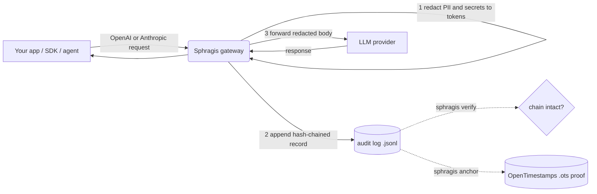

<div align="center">

# Sphragis

**The EU AI Act compliance gateway you actually control.**

A single Go binary that sits between your apps and any OpenAI- or
Anthropic-compatible LLM. It strips personal data out of every request *before*
it leaves your network and writes a tamper-evident, hash-chained record of each
call. Self-hosted, no SaaS in the data path. We never see your prompts.

[](https://sphragis.eu)
[](LICENSE)
[](go.mod)
[](https://github.com/sphragis-oss/sphragis/actions/workflows/ci.yml)
[](#project-status)

[**sphragis.eu**](https://sphragis.eu) &nbsp;&bull;&nbsp; [Quick start](#quick-start) &nbsp;&bull;&nbsp; [Install](#install) &nbsp;&bull;&nbsp; [Contributing](CONTRIBUTING.md) &nbsp;&bull;&nbsp; [Roadmap](ROADMAP.md)

</div>

> The name is the Greek σφραγίς (*sphragís*), the seal pressed into wax to prove a
> document is authentic and untampered. That is exactly what the audit log does.

> **Status: early.** The proxy, PII/secret redaction, the hash-chained audit log,
> verification, and OpenTimestamps anchoring all work and are tested. Bundled ML
> entity recognition and output redaction are on the [roadmap](ROADMAP.md).

## Why

The EU AI Act and GDPR pull you two ways at once: keep personal data out of
third-party model providers, **and** be able to prove what you sent and when.

The usual "fix" is a third-party SaaS scrubber, which just hands your data to
*another* processor. Sphragis inverts that. Everything happens inside your own
trust boundary:

- **Redaction is local.** Emails, cards, IBANs, secrets, keys and more are
  replaced with stable tokens (`[EMAIL_1]`, `[IBAN_1]`, ...) before a single byte
  leaves the machine.
- **The audit log is local and tamper-evident.** Every call is hash-chained;
  altering, reordering or dropping any record breaks verification.
- **Only an opaque hash ever leaves**, and only if you opt into public anchoring.
  Your prompts never reach us. There is no "us" in the data path.

## How it works



1. The gateway parses the request body for its wire format (OpenAI or Anthropic).
2. PII and secrets are detected and replaced with stable `[KIND_n]` tokens.
3. A record is appended to an append-only log: `sha256(redacted payload)`, the
   previous record's hash, a sequence number and timestamp, all chained.
4. The redacted request is forwarded upstream. **If the audit write fails, the
   gateway fails closed** and refuses to forward the call.

`sphragis verify` later replays the log, checks every chain link and per-record
hash, and prints the Merkle root. `sphragis anchor` timestamps that root publicly
so you can later prove the log existed at a point in time.

## Quick start

```bash
make build

export SPHRAGIS_UPSTREAM_BASE_URL=https://api.openai.com
export SPHRAGIS_UPSTREAM_API_KEY=sk-...   # your real provider key
./sphragis serve                          # foreground, listens on :8787
```

Point any OpenAI SDK at the gateway by setting the base URL to
`http://localhost:8787/v1`. PII in message content is tokenized before the
request is forwarded, and every call is appended to the audit log.

Verify the log has not been tampered with:

```bash
./sphragis verify ~/.sphragis/audit.jsonl
# OK: 42 records, chain intact
# merkle_root: 58075bc5...
```

If any record was altered, reordered or removed, verification fails and names the
offending sequence number.

## Install

**Homebrew (macOS):**

```bash
brew install --cask sphragis-oss/sphragis/sphragis
```

**Script (macOS / Linux), prebuilt binary:**

```bash
curl -fsSL https://raw.githubusercontent.com/sphragis-oss/sphragis/main/install.sh | bash
```

**From source (needs Go 1.26):**

```bash
go install github.com/sphragis-oss/sphragis/cmd/sphragis@latest
# or, from a clone:
make install        # installs to /usr/local/bin, PREFIX overridable
```

Prebuilt binaries and checksums for linux/macOS (amd64/arm64) are attached to
each [GitHub release](https://github.com/sphragis-oss/sphragis/releases), built
by GoReleaser on tag push. systemd and launchd unit templates live in
[`init/`](init/).

> Homebrew Casks are macOS-only. On Linux, use the install script or build from
> source.

## Running as a daemon

```bash
sphragis start            # run in the background
sphragis status           # running? listen addr, audit log, auto-anchor state
sphragis restart
sphragis stop

sphragis version          # print the version
```

PID, logs, state and the default audit log live under `~/.sphragis` (override
with `SPHRAGIS_HOME`). Use `sphragis serve` to run in the foreground instead.

## Supported request formats

Redaction dispatches on the request path, so one gateway covers the major agent
and SDK clients:

| Path | Format | Used by |
|---|---|---|
| `/v1/chat/completions` | OpenAI chat completions | OpenAI SDKs, Cursor, LangChain |
| `/v1/responses` | OpenAI Responses API | Codex CLI |
| `/v1/messages` | Anthropic Messages API | Claude Code |
| `/v1/messages/count_tokens` | Anthropic token counting | Claude Code, SDKs |
| `/v1/messages/batches` | Anthropic Message Batches | batch jobs |
| `/v1/complete` | Anthropic legacy Text Completions | legacy clients |

Point each client at the gateway:

- Claude Code: `ANTHROPIC_BASE_URL=http://localhost:8787`
- Codex: `OPENAI_BASE_URL=http://localhost:8787/v1`
- OpenAI SDKs: base URL `http://localhost:8787/v1`

Both string and structured bodies are handled, including Anthropic `document`
blocks, `tool_use` inputs and `tool_result` content. Signed `thinking` blocks are
left intact so signatures stay valid. Streamed (`stream: true`) responses are
flushed through chunk by chunk. Other paths are proxied through unchanged, with no
redaction.

## What gets redacted

| Kind | Token | Matcher |
|---|---|---|
| Email | `[EMAIL_n]` | RFC-ish address pattern |
| Phone | `[PHONE_n]` | `+CC NN NNNNN` international form |
| IBAN | `[IBAN_n]` | country code + check digits + groups |
| Card | `[CARD_n]` | 13-19 digit PAN, Luhn-validated |
| SSN | `[SSN_n]` | US `NNN-NN-NNNN` |
| IP | `[IP_n]` | IPv4 address |
| Secret | `[SECRET_n]` | value after `password`/`secret`/`api_key`/`token`, and `Bearer` tokens |
| API key | `[APIKEY_n]` | OpenAI/Anthropic, AWS, GitHub, Google, Slack, Stripe, SendGrid |
| Private key | `[PRIVATEKEY_n]` | PEM `BEGIN ... PRIVATE KEY` blocks |
| JWT | `[JWT_n]` | three base64url segments |
| Custom names | `[NAME_n]` | your own term list (`SPHRAGIS_CUSTOM_TERMS_FILE`) |
| Name / Address / Health | `[NAME_n]` `[ADDRESS_n]` `[HEALTH_n]` | optional external NER service (below) |

Tokens are stable within a text field: the same value always maps to the same
number, so the model can still reason about "the same person" without ever seeing
them.

Arbitrary names, addresses and health terms cannot be matched by regex. Point
`SPHRAGIS_NER_URL` at an NER service (for example a Microsoft Presidio sidecar)
that accepts `{"text": "..."}` and returns
`{"entities": [{"type": "PERSON", "text": "..."}]}`. The gateway tokenizes the
returned spans. NER is best-effort and **fails open**, so an NER outage never
blocks regex redaction. Without it, feed known names and codenames through the
custom-terms file.

## Anchoring (optional)

Anchoring proves your audit log existed at a point in time, without revealing its
contents. Only the opaque Merkle root leaves your network, never the prompts.

```bash
sphragis anchor now [log]    # timestamp the current log's root once
sphragis anchor on 24h       # enable automatic anchoring every 24h
sphragis anchor off          # disable automatic anchoring
sphragis anchor status       # show auto-anchor state
```

`anchor` verifies the log, submits its Merkle root to public
[OpenTimestamps](https://opentimestamps.org/) calendar servers, and writes a
`.ots` proof next to the log. The proof starts pending; run `ots upgrade
<file>.ots` later to attach the Bitcoin attestation and `ots verify` to check it.
Override the calendars with `SPHRAGIS_OTS_CALENDARS` (comma-separated).

## Configuration

| Env var | Default | Purpose |
|---|---|---|
| `SPHRAGIS_LISTEN_ADDR` | `:8787` | Address the gateway listens on |
| `SPHRAGIS_UPSTREAM_BASE_URL` | `https://api.openai.com` | Upstream LLM provider base URL |
| `SPHRAGIS_UPSTREAM_API_KEY` | (none) | Provider key; if unset, the client's `Authorization` header is forwarded |
| `SPHRAGIS_AUDIT_LOG_PATH` | `~/.sphragis/audit.jsonl` | Append-only audit log path |
| `SPHRAGIS_HOME` | `~/.sphragis` | State directory (pid, logs, default audit log) |
| `SPHRAGIS_CUSTOM_TERMS_FILE` | (none) | File of extra terms to redact, one per line (names, codenames) |
| `SPHRAGIS_NER_URL` | (none) | External NER service for names/addresses/health terms |
| `SPHRAGIS_OTS_CALENDARS` | public OTS calendars | Comma-separated OpenTimestamps calendar URLs |

## Project status

Sphragis is open source under Apache 2.0 and built in the open. The goal is to
grow it into a community-governed, vendor-neutral project and submit it to the
[CNCF](https://www.cncf.io/) Sandbox. See the [roadmap](ROADMAP.md) for what's
next; contributions, issues and design feedback are all welcome.

## Commercial offering

Sphragis the project is, and will remain, fully open source. A separate
commercial product (managed deployment, multi-user admin, SSO/RBAC, team
policies, the EU AI Act Article 26/53 report generator and managed anchoring) is
built *on top of* this open core, in its own repository. This mirrors the
Crossplane / Upbound model: the open project stands on its own, the commercial
product is an optional layer above it. **Nothing in this repository requires a
license key.**

## Development

```bash
make test     # go test ./...
make vet
make build
golangci-lint run
```

## Community

- [Contributing guide](CONTRIBUTING.md) (dev setup, DCO sign-off, PR flow)
- [Code of conduct](CODE_OF_CONDUCT.md)
- [Governance](GOVERNANCE.md) and [maintainers](MAINTAINERS.md)
- [Security policy](SECURITY.md), report vulnerabilities privately
- [Roadmap](ROADMAP.md) and [changelog](CHANGELOG.md)

## License

[Apache License 2.0](LICENSE). See [NOTICE](NOTICE) for attribution.
